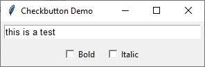
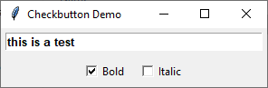
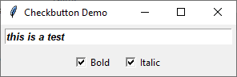

# Bold and Italic realtime apply
 






4. open `app.py`

```
from tkinter import *

class CheckFont(Frame):
    def __init__(self):
        Frame.__init__(self)
        self.pack(expand=YES, fill=BOTH)
        self.master.title("Checkbutton Demo")
        
        self.frame1 = Frame(self)
        self.frame1.pack()
        
        self.text = Entry(self.frame1, width=40, font="Arial 10")
        self.text.insert(INSERT, "this is a test")
        self.text.pack(padx=5, pady=5)

        self.frame2 = Frame(self)
        self.frame2.pack()
        
        self.boldOn = BooleanVar()
        self.italicOn = BooleanVar()

        self.checkBold = Checkbutton(self.frame2, text="Bold", variable=self.boldOn, command=self.changeFont)
        self.checkBold.pack(side=LEFT, padx=5, pady=5)

        self.checkItalic = Checkbutton(self.frame2, text="Italic", variable=self.italicOn, command=self.changeFont)
        self.checkItalic.pack(side=LEFT, padx=5, pady=5)

    def changeFont(self):
        # Start with the base font
        desiredFont = "Arial 10"
        
        # Add 'bold' and/or 'italic' if the corresponding checkboxes are selected
        if self.boldOn.get() and self.italicOn.get():
            desiredFont = "Arial 10 bold italic"
        elif self.boldOn.get():
            desiredFont = "Arial 10 bold"
        elif self.italicOn.get():
            desiredFont = "Arial 10 italic"
        
        # Update the font of the text widget
        self.text.config(font=desiredFont)

CheckFont().mainloop()
```