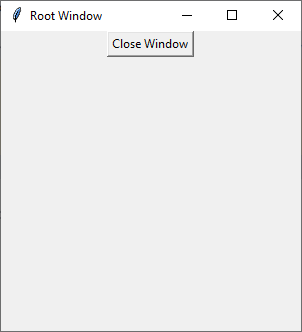

# Tkinter Root Window

In this example, we create a Tkinter root window and define a function `close_window()` that calls the `destroy()` method on the root window object. This method terminates the main loop and destroys all widgets contained within the root window, effectively closing the window and ending the application.

```
import tkinter as tk


def close_window():
    root.destroy()


root = tk.Tk()
root.title("Root Window")
root.geometry('300x300')

# Create widgets and layout here

close_button = tk.Button(root, text="Close Window", command=close_window)
close_button.pack()

root.mainloop()
```

