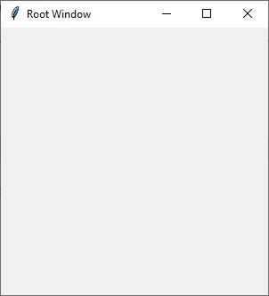
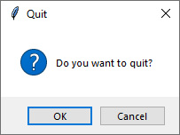

# Customizing Close Behavior

In this example, we use the `protocol()` method to customize the behavior when the user attempts to close the window using the window manager’s close button 
(e.g., clicking the “X” button on the window). We define the `on_closing()` function to ask the user for confirmation before closing the window. 
If the user confirms, the root window is destroyed.

```
import tkinter as tk
import tkinter.messagebox

def on_closing():
    if tk.messagebox.askokcancel("Quit", "Do you want to quit?"):
        root.destroy()


root = tk.Tk()
root.title("Root Window")
root.geometry('300x300')

# Create widgets and layout here

root.protocol("WM_DELETE_WINDOW", on_closing)

root.mainloop()
```



