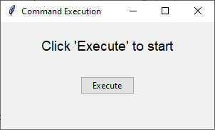
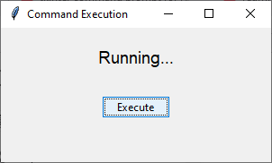
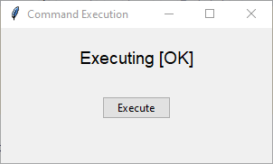
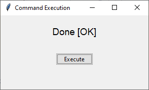

To display a command execution process with status updates like "Running...", "Executing [OK]", "Done [OK]" in a `tkinter` window, you can update the GUI during the execution of your command. Here's an example of how to implement such a process:

```python
import tkinter as tk
from tkinter import ttk

# Function to simulate the command execution
def execute_command():
    status_label.config(text="Running...")
    root.update()  # Update the GUI to reflect the change
    # Simulate a delay (e.g., running a long process)
    root.after(2000)  # Delay for 2 seconds (2000 ms)
    
    status_label.config(text="Executing [OK]")
    root.update()
    root.after(2000)  # Delay for 2 seconds

    status_label.config(text="Done [OK]")
    root.update()

# Create the tkinter window
root = tk.Tk()
root.title("Command Execution")

# Create and position the label to display status
status_label = ttk.Label(root, text="Click 'Execute' to start", font=("Arial", 14))
status_label.pack(pady=20)

# Create and position the execute button
execute_button = ttk.Button(root, text="Execute", command=execute_command)
execute_button.pack(pady=10)

# Run the tkinter main loop
root.mainloop()
```

### Explanation:
1. **`status_label`**: A label to display the status of the process.
2. **`execute_command`**: The function that simulates command execution, updating the label's text at each stage.
3. **`root.after`**: Simulates a delay between updates, as if the command is being processed.
4. **`root.update()`**: Forces the GUI to refresh after each label update, allowing the user to see the status changes in real time.

This will display:
- "Running..." for 2 seconds,
- Then "Executing [OK]" for another 2 seconds,
- Finally "Done [OK]".




