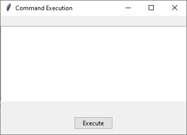
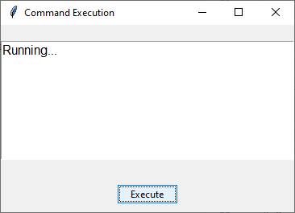
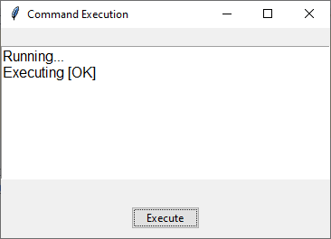
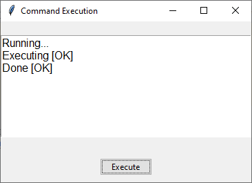

To display the status messages in a `tkinter` **disabled text area** instead of a label, you can modify the `tkinter.Text` widget. This text widget can be set to **disabled** while still allowing you to update its content programmatically by temporarily enabling it for updates and then disabling it again.

Here’s how you can implement it:

```python
import tkinter as tk
from tkinter import ttk

# Function to simulate the command execution
def execute_command():
    # Enable text widget temporarily to update content
    status_text.config(state='normal')
    status_text.insert(tk.END, "Running...\n")
    status_text.config(state='disabled')
    root.update()  # Update the GUI
    root.after(2000)  # Simulate delay for 2 seconds

    status_text.config(state='normal')
    status_text.insert(tk.END, "Executing [OK]\n")
    status_text.config(state='disabled')
    root.update()
    root.after(2000)  # Simulate delay for 2 seconds

    status_text.config(state='normal')
    status_text.insert(tk.END, "Done [OK]\n")
    status_text.config(state='disabled')
    root.update()

# Create the tkinter window
root = tk.Tk()
root.title("Command Execution")

# Create a disabled text widget for displaying status
status_text = tk.Text(root, height=8, width=40, font=("Arial", 12))
status_text.pack(pady=20)
status_text.config(state='disabled')  # Set the text widget to disabled initially

# Create and position the execute button
execute_button = ttk.Button(root, text="Execute", command=execute_command)
execute_button.pack(pady=10)

# Run the tkinter main loop
root.mainloop()
```

### Explanation:
1. **`status_text`**: A `tkinter.Text` widget that is initially set to **disabled**. This makes it non-editable by the user.
2. **`status_text.config(state='normal')`**: Temporarily enables the text widget to allow adding new lines of text.
3. **`status_text.insert(tk.END, ...)`**: Inserts the new status message at the end of the text area.
4. **`status_text.config(state='disabled')`**: Disables the text widget again after updating, ensuring that it remains non-editable.

Each time the command runs, new status messages ("Running...", "Executing [OK]", "Done [OK]") will be appended to the disabled text area.




